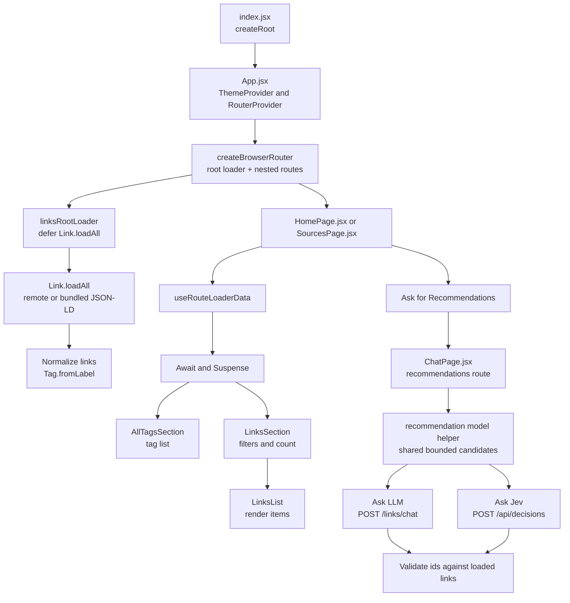

An index of great learning resources - applicable for career development in software and engineering leadership.

[](https://dl.circleci.com/status-badge/redirect/gh/johnpfeiffer/links-app/tree/main)

# File Layout

- `KERNEL/`: human only authoring of invariants and requirements
- `cloud-deploy.sh`: deploys the `app/` directory to the hosting repo.
- `app/`: the deployable application (see below).

## App Directory (`app/`)

- `index.html`: HTML entry point.
- `package.json`: dependencies and scripts.
- `vite.config.js`: Vite build configuration.
- `src/index.tsx`: app entry point (mounts React).
- `src/App.tsx`: router + theme; wires the top-level routes.
- `src/components/`: UI modules (e.g., `HomePage.tsx`, `SourcesPage.tsx`, `LinksSection.tsx`).
- `src/lib/`: app helpers (`parseUrlPath`).
- `src/models/`: data models and collection helpers (`tag.js`, `tags.js`, `link.js`, `links.js`).
- `src/content/`: JSON-LD data sources loaded at runtime.
- Recommendations: Links View route `/_chat` or `/:app/_chat`; users choose the existing LLM route `POST /links/chat` or Jev via `POST /api/decisions`.

## Content Schema

This application loads the `favorites` JSON-LD files from GitHub and falls back to the bundled copies when remote loading fails.

Each `src/content/*.jsonld` file is a schema.org `ItemList`. Its entries use schema.org field names throughout loading, the internal model, and rendering:

```json
{
  "@context": "https://schema.org",
  "@type": "ItemList",
  "name": "AI",
  "itemListElement": [
    {
      "@type": "PodcastEpisode",
      "name": "Lex Fridman: Gustav Soderstrom on AI in Spotify Music",
      "url": "https://lexfridman.com/gustav-soderstrom/",
      "datePublished": "2019-07-29",
      "keywords": [
        "AI",
        "Machine Learning",
        "Podcast"
      ]
    }
  ]
}
```

An entry may also provide `@id`, `description`, and `archivedAt`. The internal `Link` model uses `id`, `url`, `name`, `description`, `keywords`, `datePublished`, and `archivedAt`; `createdAt` remains ingest metadata.

## Development

```bash
cd app
npm install
npm run dev
```

## Testing

```bash
cd app
npm test
npm run typecheck
npm run build
# Or run all three gates:
npm run check
```

Also see <https://blog.john-pfeiffer.com/ai-opportunities-need-improved-spec-driven-development-with-tla/>

## Application Flow



See `architecture.md` for the chat recommendations system and user journey diagrams.

The browser never sends provider credentials or a Jev model; the deployment gateway selects the configured Decisions model. Both engines count successful grounded answers toward the same three-answer session limit, while failures and Jev's `none_of_the_above` result do not.

## Summary

Links offers separate, grounded “Ask LLM” and “Ask Jev” recommendation paths.
