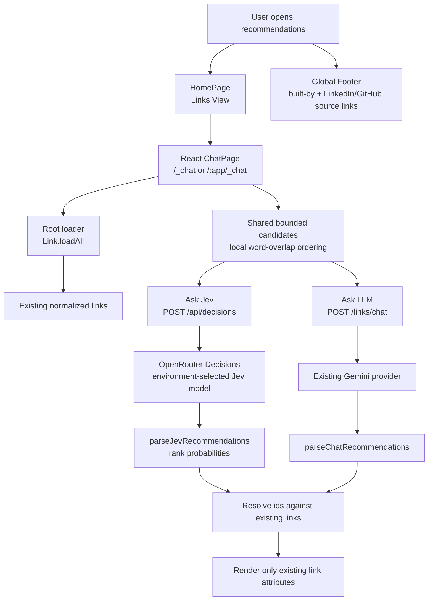
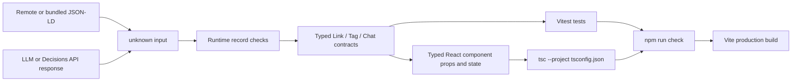
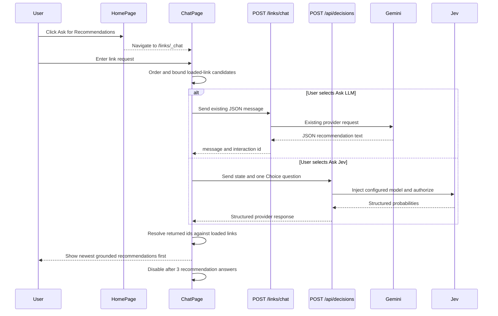
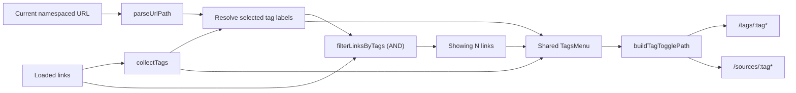
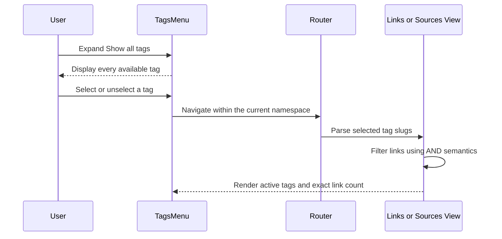
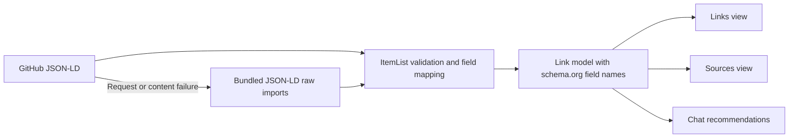
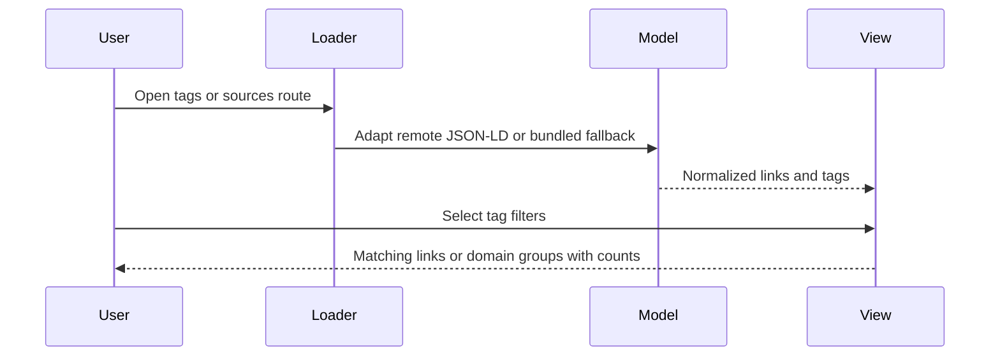

# Architecture

This document records derived implementation facts. `/KERNEL/` remains the authority.

## Material UI runtime

`@mui/material` and `@mui/icons-material` are pinned together at `9.4.0` in
`app/package.json`. The lockfile resolves the MUI system, styling engine, theme,
types, and utilities to `9.4.0`, with `react-is` matching React `19.2.8`.
Emotion remains the styling engine. `App` supplies the shared `ThemeProvider`
and `CssBaseline`; pages use `sx` for layout and the chat input uses
`slotProps.htmlInput` for its character limit. No component API changes were
needed to complete the 9.2-to-9.4 dependency update.

Validation on 2026-09-21: `rtk npm run check` passed strict typechecking,
all 93 tests across 17 files, and the Vite production build. Integration tests
cover provider selection, grounded response rendering, the combined
three-answer limit, no-match handling, and pending-request controls with mocked
API responses.

The build retains its existing warning for the approximately 532 kB main chunk.
`npm audit` reports two moderate vulnerable packages in React Router, outside
the MUI dependency graph; these remain a separate router upgrade follow-up.

## System Design

Content loading: `Link.loadAll` fetches the five favorites JSON-LD files from
`raw.githubusercontent.com` (`main`) with the default HTTP cache mode, so GitHub's 5-minute
CDN TTL (`cache-control: max-age=300`) bounds content staleness. The bundled
`app/src/content/*.jsonld` copies are only an offline fallback and are refreshed manually
from the favorites repo.

## Type-Safety Gates

The application is authored in TypeScript with strict compiler settings in `app/tsconfig.json`.
Untrusted remote content and recommendation responses enter as `unknown` and are narrowed before use; static
types complement rather than replace those runtime checks.

The visible chat UI route is separate from both provider gateways. The UI is
reachable from the Links View at `/_chat` for a root-hosted app and
`/:app/_chat` for app-prefixed hosting, such as `/links/_chat`. The existing LLM
path remains `POST /links/chat`; the stateless Jev path is
`POST /api/decisions`.

## Chat Journey

The Jev request keeps the user's input in `state.user_request` and creates one
`best_link` Choice. Criteria keys are canonical IDs from exactly the bounded
candidate subset used by the LLM prompt; values contain compact loaded title,
description, and tag data. `none_of_the_above` is the only reserved option.
Responses are read from `answers.best_link.probabilities`, sorted descending,
limited to three, and resolved back to loaded records. Unknown or duplicate IDs
never render. A winning no-match option produces the informational “No strong
match found” state and does not consume a recommendation answer.

## Invariant Mapping

- `INV-017`: Chat renders only recommendations whose link ids resolve to currently loaded links. Unknown ids and duplicate ids inside a recommendation are dropped before display.
- `INV-018`: Chat displays `Recommendations used: N / 3` near the provider buttons and disables both after three successful recommendation answers across either engine. Failed requests and Jev no-match results do not increment the count.
- Requirements v7: The Links View exposes `Ask for Recommendations` below Sources navigation and routes users to `/:app/_chat`.
- Chat UI behavior: New recommendation answers are prepended above older answers so the newest response stays nearest the request controls.
- Provider selection does not change the state predicates for `INV-017` or `INV-018`, so no TLA+ predicate change is required.

## Shared Tag Filtering

`TagsMenu` is the shared presentation boundary for tag discovery, active-filter removal,
and the exact filtered-link count. `LinksSection` configures it for the `tags` namespace;
`SourcesPage` configures the same component for the `sources` namespace. Route construction
is centralized in `buildTagFilterPath` and `buildTagTogglePath`, so adding or removing a tag
keeps the user in the current view and preserves any application-name prefix.

### Tag-Filtering Journey

This preserves `INV-006` through `INV-010`: selected tag slugs remain canonical and unique,
selection uses AND semantics, no selection includes every link, and both views display the
exact count of included links. The Sources View then derives its domain membership and counts
from that filtered set, preserving `INV-011` through `INV-013`.

## Global Footer

`app/src/components/Footer.tsx` is a pure presentational component rendered once in `App.tsx` (inside the `ThemeProvider`, after the `RouterProvider`) so it appears on every route. It shows a "Built by John Pfeiffer" line with LinkedIn and GitHub source-link icons (`@mui/icons-material`); the GitHub link points at this repository. Covered by `Footer.test.tsx` (jsdom, `createRoot` + `act`).

## JSON-LD migration (requirements v9)

The content boundary reads the supplied compact schema.org `ItemList` profile.
`models/jsonld.ts` validates the schema.org fields `name`, `keywords`,
`datePublished`, and `archivedAt`, while optional `@id` supplies the internal id.
The same field names continue through the Link model and views without aliases.
Descriptions keep the existing name fallback and publication-year suffix. Missing
ids retain the existing generated-id behavior. The source files are never mutated.
The legacy JSON files remain as migration comparison fixtures; runtime loading
uses only JSON-LD. No schema type is added as an implicit tag.

Remote loading keeps the same GitHub location and HTTP cache policy, with `.jsonld`
extensions. A failed request or invalid ItemList triggers the complete bundled
fallback. Bundled files use Vite raw imports and explicit JSON parsing; invalid
bundled data fails visibly instead of silently returning an incomplete collection.
This adapter supports the supplied profile, not arbitrary JSON-LD expansion,
remote contexts, graph documents, or ListItem wrappers.

Migration validation: 605 records (AI 54, Business 36, Engineering 180,
History 50, People 285) compared exhaustively against the supplied legacy files.
Tests cover original field parity, all single-tag selections and their source
memberships/counts, alternate URL preservation, malformed content rejection,
offline fallback, remote caching, and existing UI integration behavior.
Reference: [schema.org ItemList](https://schema.org/ItemList).
