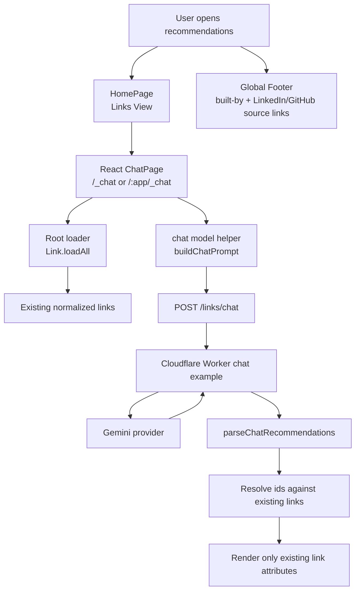
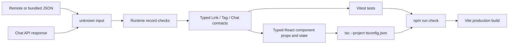
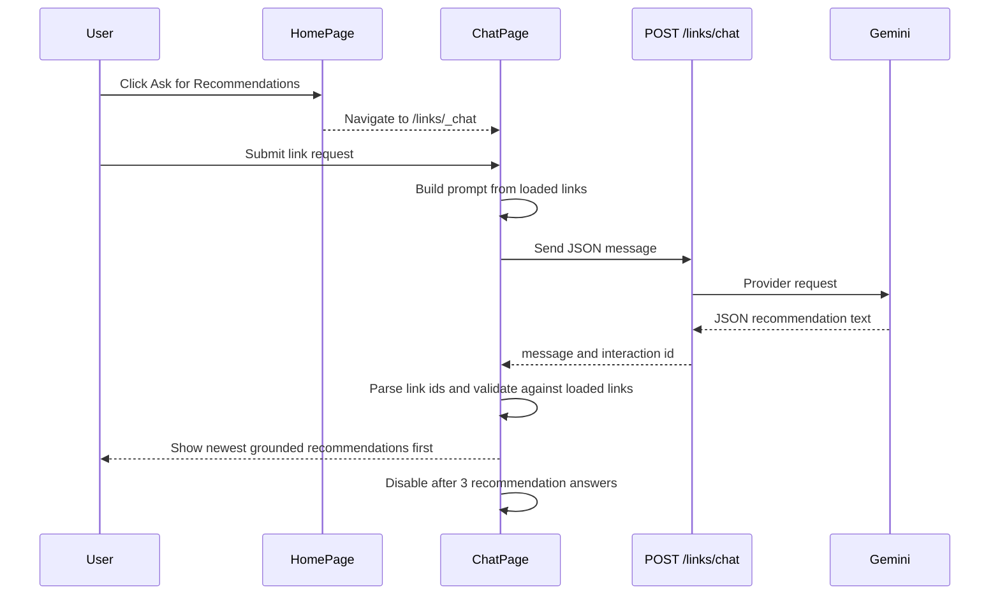
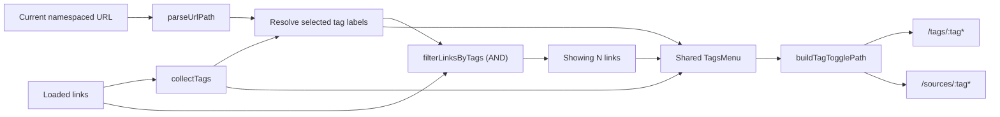
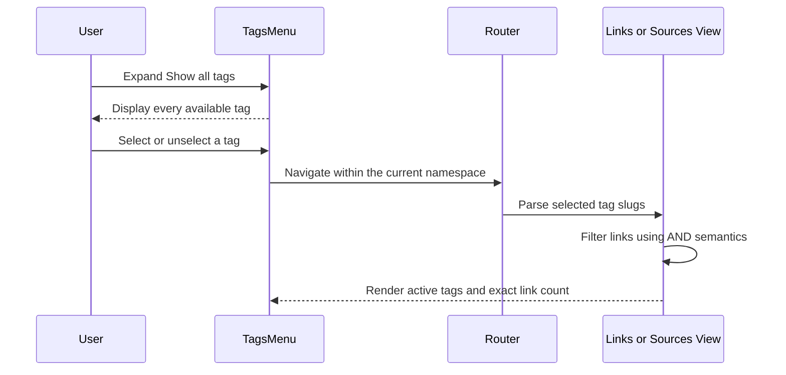

# Architecture

This document records derived implementation facts. `/KERNEL/` remains the authority.

## System Design

Content loading: `Link.loadAll` fetches the five favorites JSON files from
`raw.githubusercontent.com` (`main`) with the default HTTP cache mode, so GitHub's 5-minute
CDN TTL (`cache-control: max-age=300`) bounds content staleness. The bundled
`app/src/content/*.json` copies are only an offline fallback and are refreshed manually
from the favorites repo.

## Type-Safety Gates

The application is authored in TypeScript with strict compiler settings in `app/tsconfig.json`.
Untrusted remote content and chat responses enter as `unknown` and are narrowed before use; static
types complement rather than replace those runtime checks.

The visible chat UI route is separate from `/links/chat` because `/links/chat` is the Cloudflare Worker API route in the imported backend example. The UI is reachable from the Links View at `/_chat` for a root-hosted app and `/:app/_chat` for app-prefixed hosting, such as `/links/_chat`.

## Chat Journey

## Invariant Mapping

- `INV-017`: Chat renders only recommendations whose link ids resolve to currently loaded links. Unknown ids and duplicate ids inside a recommendation are dropped before display.
- `INV-018`: Chat displays `Recommendations used: N / 3` near the Send button and disables new submissions after three successful recommendation answers.
- Requirements v7: The Links View exposes `Ask for Recommendations` below Sources navigation and routes users to `/:app/_chat`.
- Chat UI behavior: New recommendation answers are prepended above older answers so the newest response stays nearest the request controls.

## Shared Tag Filtering

`TagsMenu` is the shared presentation boundary for tag discovery, active-filter removal,
and the exact filtered-link count. `LinksSection` configures it for the `tags` namespace;
`SourcesPage` configures the same component for the `sources` namespace. Route construction
is centralized in `buildTagFilterPath` and `buildTagTogglePath`, so adding or removing a tag
keeps the user in the current view and preserves any application-name prefix.

### Tag-Filtering Journey

This preserves `INV-006` through `INV-010`: selected tag slugs remain canonical and unique,
selection uses AND semantics, no selection includes every link, and both views display the
exact count of included links. The Sources View then derives its domain membership and counts
from that filtered set, preserving `INV-011` through `INV-013`.

## Global Footer

`app/src/components/Footer.tsx` is a pure presentational component rendered once in `App.tsx` (inside the `ThemeProvider`, after the `RouterProvider`) so it appears on every route. It shows a "Built by John Pfeiffer" line with LinkedIn and GitHub source-link icons (`@mui/icons-material`); the GitHub link points at this repository. Covered by `Footer.test.tsx` (jsdom, `createRoot` + `act`).
